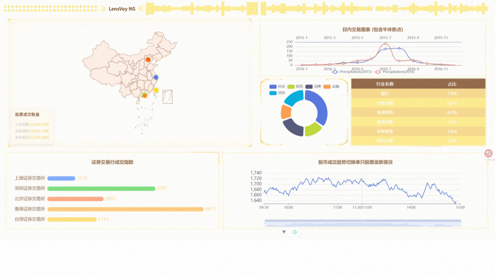

# LensVoy NG

This template should help get you started developing with Vue 3 in Vite.

## Recommended IDE Setup

[VSCode](https://code.visualstudio.com/) + [Volar](https://marketplace.visualstudio.com/items?itemName=Vue.volar) (and disable Vetur).

## Customize configuration

See [Vite Configuration Reference](https://vite.dev/config/).

## Project Setup

```sh
npm install
```

### Compile and Hot-Reload for Development

```sh
npm run dev
```

### Compile and Minify for Production

```sh
npm run build
```

基于你提供的信息，我为你编写了一份适合 `LensVoy NG` 项目的 `README.md`，突出了金融股票数据可视化的核心特点和技术栈：

```markdown
# LensVoy NG

金融股票数据可视化大屏解决方案，基于现代前端技术栈构建，提供直观、高效的股票市场数据监控与分析能力。



## 项目简介

LensVoy NG 是一款专注于金融股票领域的数据可视化大屏应用，通过直观的图表展示、实时数据监控和多维度分析，帮助用户快速把握股市动态，做出更明智的投资决策。

## 技术栈

- **核心框架**：Vue 3
- **路由管理**：Vue Router
- **数据可视化**：ECharts
- **大屏组件库**：DataV
- **开发语言**：HTML5, CSS3, JavaScript

## 快速开始

### 前置要求

- Node.js 14.0+
- npm 6.0+ 或 yarn 1.22+

### 安装步骤

1. 克隆仓库
   ```bash
   git clone https://github.com/your-username/lensvoy-ng.git
   cd lensvoy-ng
   ```

2. 安装依赖
   ```bash
   npm install
   ```

3. 启动开发环境
   ```bash
   npm run dev
   ```

4. 构建生产版本
   ```bash
   npm run build
   ```

## 功能特点

- 实时股票行情监控大屏
- 多维度数据可视化图表（K线图、趋势图、分布图表等）
- 自定义看板配置

## 项目结构

```
lensvoy-ng/
├── public/               # 静态资源
├── docs/                 # 新建的docs文件夹（存放截图、文档等）
├── src/
│   ├── assets/           # 图片、样式等资源
│   ├── components/       # 自定义组件
│   ├── router/           # 路由配置
│   ├── views/            # 页面视图
│   ├── utils/            # 工具函数
│   ├── main.js           # 入口文件
│   └── App.vue           # 根组件
├── package.json          # 项目配置
└── README.md             # 项目说明
```

## 许可证

本项目采用 [Apache License 2.0](LICENSE) 开源协议。

## 贡献指南

欢迎通过 Issue 或 Pull Request 参与项目贡献。提交 PR 前请确保代码符合项目规范，并通过基础测试。

